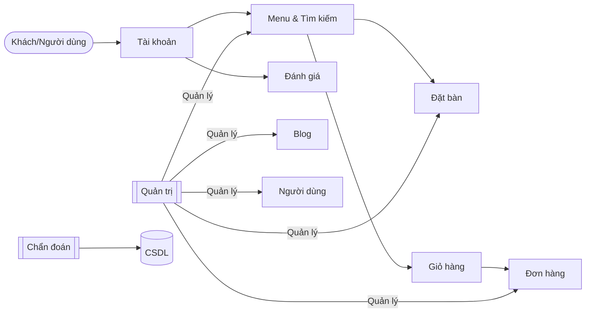
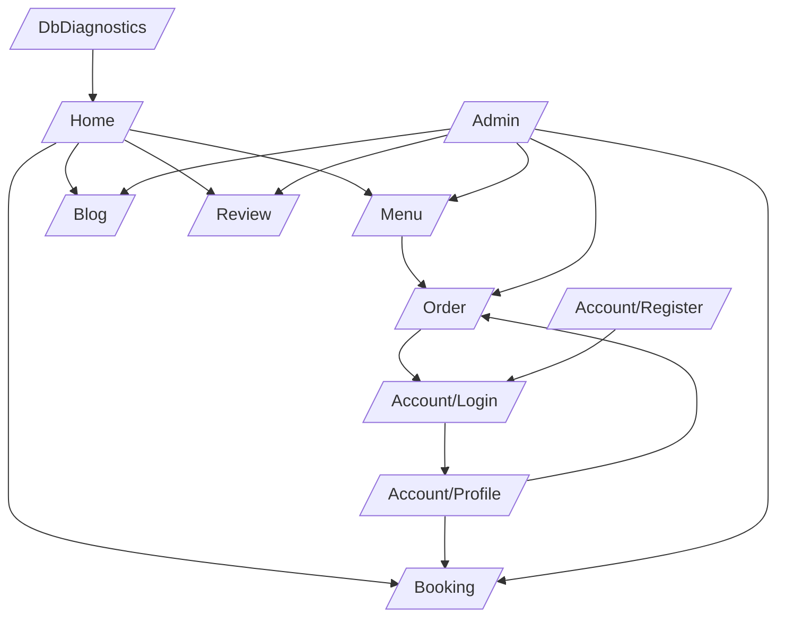

# Đặc tả tổng quan hệ thống Restaurantly

Tài liệu này mô tả các khía cạnh chính của website nhà hàng: sơ đồ chức năng, sơ đồ liên kết (site map), lược đồ cơ sở dữ liệu, và mô tả giao diện theo nhóm trang.

## 1.1. Các module chức năng — Sơ đồ chức năng
- Menu & tìm kiếm: xem danh mục món, xem chi tiết món .
- Đặt bàn (Booking): chọn ngày/giờ/số người, gửi yêu cầu đặt.
- Đặt món/Đơn hàng (Order): tạo đơn, quản lý giỏ, xác nhận thanh toán.
- Blog/Tin tức: đọc bài viết, xem chi tiết.
- Đánh giá (Review): đăng đánh giá, xem đánh giá.
- Quản trị (Admin): quản lý menu, đơn hàng, đặt bàn, bài blog, người dùng.
- Chẩn đoán/Diagnostics: theo dõi kết nối DB, thông tin hệ thống.



## 1.2. Site map — Sơ đồ liên kết

Các tuyến trang chính (tham khảo theo cấu trúc Controllers hiện có):

- Trang chủ: `/` (Home)
- Menu: `/menu`
- Đặt bàn: `/booking`
- Đơn hàng: `/order` (bao gồm giỏ, xác nhận)
- Blog: `/blog`
- Đánh giá: `/review`
- Tài khoản: `/account/login`, `/account/register`, `/account/profile`
- Quản trị: `/admin` (bảng điều khiển và các mục quản lý)
- Chẩn đoán DB: `/dbdiagnostics`



## 1.3. Database diagram — Lược đồ quan hệ

Mô tả các thực thể chính và quan hệ dự kiến (tham chiếu các Model hiện có: `User`, `MenuItem`, `Order`, `OrderItem`, `Booking`, `Review`, `BlogEntry`).

```mermaid
erDiagram
    User {
        int Id
        string UserName
        string Email
        string PasswordHash
        string Role
        datetime CreatedAt
    }

    Booking {
        int Id
        int UserId
        string FullName
        string Phone
        string Email
        date BookingDate
        string TimeSlot
        int PeopleCount
        string Note
        string Status
        datetime CreatedAt
    }

    MenuItem {
        int Id
        string Name
        string Description
        decimal Price
        string Category
        string ImageUrl
        bool IsAvailable
    }

    Order {
        int Id
        int UserId
        decimal TotalPrice
        string Status
        datetime CreatedAt
    }

    OrderItem {
        int Id
        int OrderId
        int MenuItemId
        int Quantity
        decimal UnitPrice
        decimal LineTotal
    }

    Review {
        int Id
        int UserId
        int? MenuItemId
        int Rating
        string Comment
        datetime CreatedAt
    }

    BlogEntry {
        int Id
        string Title
        string Slug
        string Content
        datetime PublishedAt
        string Author
    }

    User ||--o{ Booking : "đặt bàn"
    User ||--o{ Order : "tạo đơn"
    Order ||--o{ OrderItem : "bao gồm"
    MenuItem ||--o{ OrderItem : "được đặt"
    User ||--o{ Review : "viết"
    MenuItem ||--o{ Review : "được đánh giá"
```

Ghi chú:
- Một người dùng có thể có nhiều đặt bàn, đơn hàng, và đánh giá.
- Mỗi đơn hàng gồm nhiều dòng `OrderItem`, tham chiếu tới `MenuItem`.
- `Review` có thể gắn với món (`MenuItemId`) hoặc đánh giá chung nếu `MenuItemId` rỗng.

## 1.4. GUI — Mô tả giao diện theo nhóm trang

- Nhóm công khai (Public):
  - Home: banner, giới thiệu, CTA tới đặt bàn/đặt món.
  - Menu: lưới món, bộ lọc theo danh mục, xem chi tiết món.
  - Blog: danh sách bài viết, trang chi tiết.
  - Review: danh sách đánh giá, biểu mẫu gửi đánh giá (đăng nhập yêu cầu).

- Nhóm Đặt bàn (Booking):
  - Form đặt bàn: họ tên, liên hệ, ngày/giờ, số người, ghi chú.
  - Xác nhận và trạng thái đặt bàn.

- Nhóm Đặt món/Đơn hàng (Order):
  - Giỏ hàng: thêm/xóa/sửa số lượng, tính tổng.
  - Checkout/Xác nhận: thông tin nhận hàng/thanh toán, trạng thái đơn.

- Nhóm Tài khoản (Account):
  - Đăng nhập/Đăng ký: email/tên đăng nhập, mật khẩu.
  - Hồ sơ: cập nhật thông tin, lịch sử đơn và đặt bàn.

- Nhóm Quản trị (Admin):
  - Dashboard: số liệu tổng quan.
  - Quản lý Menu: CRUD món ăn.
  - Quản lý Đơn hàng: xem/trạng thái đơn.
  - Quản lý Đặt bàn: xác nhận/hủy/sắp xếp.
  - Quản lý Blog: CRUD bài viết.
  - Quản lý Người dùng: phân quyền/cơ bản.

- Nhóm Chẩn đoán (Diagnostics):
  - Thông tin DB/chuỗi kết nối, trạng thái dịch vụ.

---

Nếu bạn muốn điều chỉnh chi tiết trường dữ liệu hoặc tuyến trang theo đúng migration hiện tại, mình có thể đối chiếu và cập nhật lại sơ đồ/miêu tả cho đồng nhất.